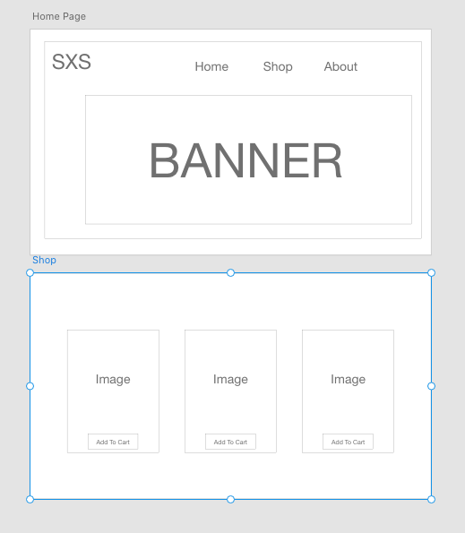

# Capstone Proposal - Clothing Store

# Mission Statement
> I have a clothing store that I currently run on Shopify. I would like to very much have full creativity in the design and functionality of my ecommerce site.  

# MVP
> This site is where customers (users) will be able to purchase products related to the lifestyle brand.

## Java Models
* Apparel
* Accessories
* Bundles

## Wireframe

## Libraries 
> I would like to use SAAS if possible. I will try to learn and setup my database through SAAS.

## Post MVP
* Add Shopping Cart
* Add User creation/login
* Add Payment acceptance

## Projected Schedule
> TBD